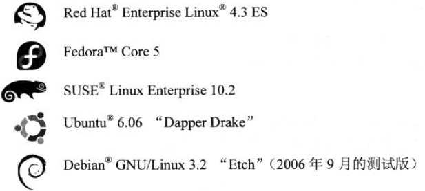
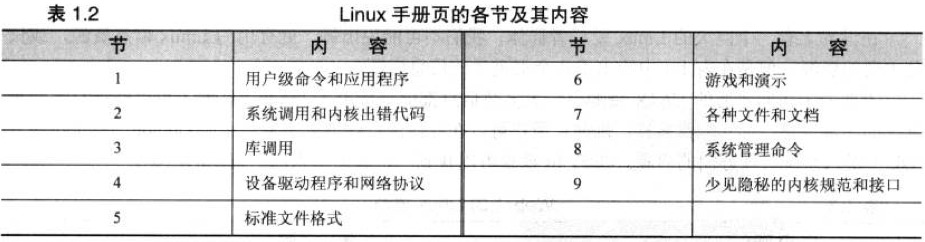
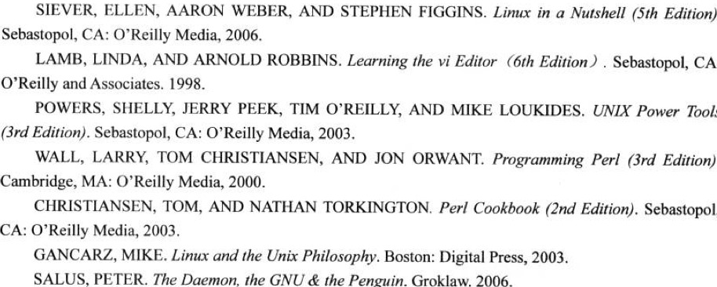

#Linux系统管理员手册
>本书支持的发行版本有：

##Chapter 1
###Pg 9.
1. Texinfo文档出现的原因？   
因为man的格式命令是AT&T专有，所以GNU人员发明了Texinfo文档。不过现在groff已经出现，能够替代nroff了。Texinfo文档错综复杂，不推荐写作文档。
2. HOWTO与guide都在哪可以找到？  
这两项都是可以在LDP(Linux Document Project)上找到。
3. Linux文档手册的构成？  

###Pg 10.
4. man的搜索路径的配置？  
>TIP：可以用manpath命令来确定man文档搜索路径  

	主要有2个方法： 
	* 在shell环境变量中设置MANPATH。
	* 在/etc/man.config或/etc/manpath.config中设置。  

###Pg 12. 
5. 几个搜索命令的命令的区别？  
	该命令包括有：which whereis type。  
	如果which命令没有找到，可以用whereis命令。后者查找范围更大，和shell的搜索路径无关。 

6. 几个搜索任意文件的命令的介绍。  
	主要有 locate find命令。 其中locate与updatedb命令配套使用。
	
7. 几个搜索帮助的命令。
	主要有 whatis apropos。都是搜索whatis库，不过前者查找word,后者string。  
	可以说 man -k == whatis && man -f == apropos。
	
###Pg 13.
8. 系统管理员的任务有哪些？ 
	* 用户管理
	* 硬件管理
	* 系统备份
	* 软件更新
	* 系统监视
	* 故障诊断
	* 文档维护
	* 系统安全
	* 帮助用户
	
###Pg 15.
9. 优秀书籍推荐。  

##Chapter 2
>主要内容是关于init的runlevel的理解。

###Pg 33.
1. 改变运行级别的做法。  
	* 修改inittab文件。
	* telinit命令
	
2. 关于系统关闭控制的命令的解释与区别。  
	系统的halt reboot命令都是来自shutdown -h 和 shutdown -r命令。  
	其中halt与poweroff的区别是，前者关闭系统，后者控制电源管理系统关闭电源。 

##Chapter 3

暂时停止。。感觉书看着有点困难。。
